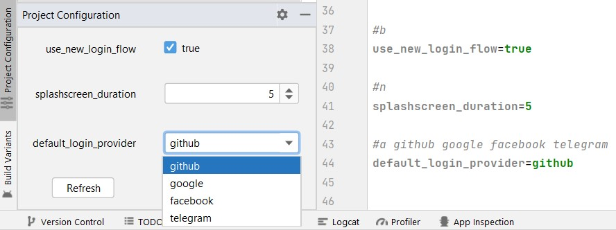

# Project Configuration
#### an Android Studio plugin
https://github.com/mikewellback/ProjectConfiguration

<!-- Plugin description -->
**Project Configuration** aims to make projects customizable in a simple way both for developers and non-developers.

This plugin will add a tool window where you can visually change some settings, that you can define on a *config.properties* file:

> **TIP**: You could already use flavors and build variants for changing project properties, but with this plugin you can manage micro-changes without creating a very big number of variants.

## Features
- Possibility of using all the properties variable on the gradle file with just a line of code
- Possibility of using the properties variable on the code files with one line per property
- Tool window updated automatically on file save
- Support various property types: BOOLEAN, NUMBER, TEXT, ARRAY, LOCKED
- No need to run a Gradle Sync in order to have the value changes updated for the build

## To do
- Visual editor for the config.properties file
- Automatically save tool window changes on the file
- More property types or configuration (e.g. possibility to set max and min value for the NUMBER property)
- Possibility of using all the properties variable on the code files without needing any additional line

## How to use
After installation, you will find a Project Configuration tool window near the Build Variants one.

From there, you will find a button that will create for you a config.properties file and a config.gradle file.

The .gradle file will add the properties variable on the <kbd>ext</kbd> object. In order to make it work it should be added as an <kbd>apply</kbd> rule on the *root* build.gradle file. Opening that file will let you copy-paste the exact line as you will find it commented.

The .properties file is where you can define your properties. To define a property, you can add indication on the previous line using comments:

| Property type  | Comment                |
|----------------|------------------------|
| `BOOLEAN`      | `#b`                   |
| `NUMBER`       | `#n`                   |
| `TEXT`         | `#t`                   |
| `ARRAY`        | `#a value1 value2 ...` |
| `LOCKED`       | `#l`                   |

Detailed information about properties configuration and characteristics can be found commented out on the same file.
